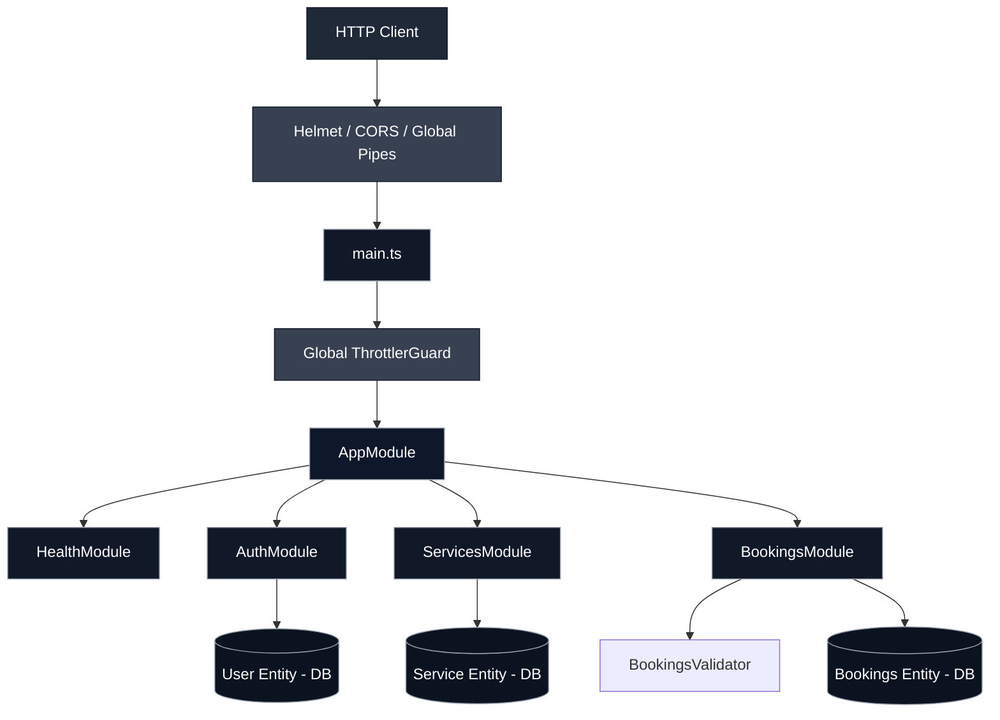
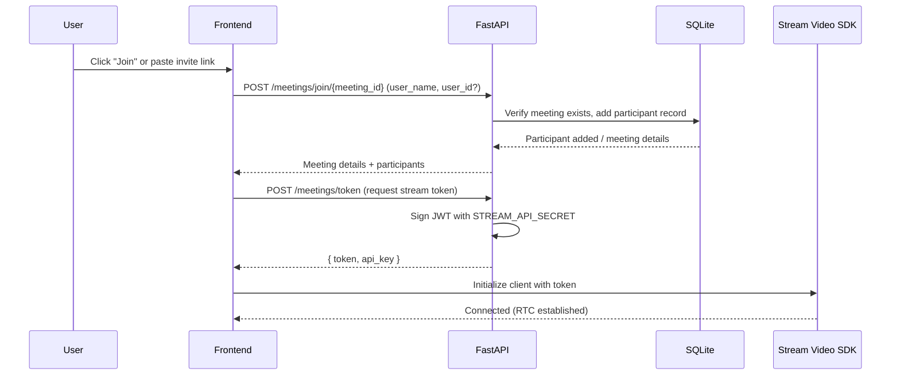
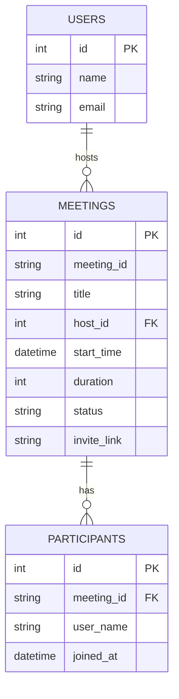

# Premium Zoom Clone

A high-fidelity Zoom clone built as a monorepo with a Next.js 16 frontend and a FastAPI + SQLAlchemy + SQLite backend. The application delivers a polished real-time conferencing experience with meeting creation, scheduling, joining, participant management, and authentication backed by a local database.

🌐 Live Demo
- https://zoom-clone-amcvf3dg5-nehas-projects-c2f830a6.vercel.app

🚀 Key Feature Implementations

1. Real-Time Video Conferencing
- Audio and video feeds with mute/unmute state handling.
- Screen sharing support using browser media streams.
- Active speaker detection and dynamic participant highlight.
- Host controls for muting or removing participants.
- Interactive in-call chat and a live participant roster.

2. Database-Backed Authentication
- Clean Zoom-style sign-in and sign-up flows.
- SQLite-backed registration and login flow with validation.
- Guest access mode for quick evaluation/demo use.
- JWT-based authentication with session persistence in localStorage.
- Sign-out support from the dashboard navbar.

3. Meeting Lifecycle & Data Modeling
- Instant and scheduled meeting creation.
- Join flow for meeting rooms via meeting ID or invite link.
- Participant tracking for hosted and joined sessions.
- Startup seeding for mock users, meetings, and historical meeting data.

📂 Project Architecture

```text
Premium Zoom Clone (Monorepo Root)
├── backend/
│   ├── app/
│   │   ├── main.py          # FastAPI application entrypoint
│   │   ├── models.py        # SQLAlchemy models for users, meetings, participants
│   │   ├── schemas.py       # Pydantic request/response schemas
│   │   ├── crud.py          # Core database operations
│   │   └── database.py      # SQLite connection and session setup
│   ├── seed.py              # Database seeding script
│   ├── requirements.txt     # Backend dependencies
│   └── zoom.db              # SQLite database file
└── frontend/
    ├── src/
    │   ├── app/              # Next.js app router pages and layout
    │   ├── components/       # Reusable UI components such as meeting modals
    │   └── lib/              # API client helpers and utilities
    ├── package.json          # Frontend dependencies and scripts
    └── next.config.ts        # Next.js configuration
```

🗄️ Relational Database Schema

- users
  - Stores unique user identities, display names, emails, and roles.
- meetings
  - Stores meeting title, host information, start time, duration, status, passcode, and invite link.
- participants
  - Tracks users associated with each meeting room and their join timestamps.

🛠️ Technology Stack

- Frontend: Next.js 16, React 19, TypeScript, Tailwind CSS, Lucide Icons, date-fns, React Hot Toast, @stream-io/video-react-sdk
- Backend: Python 3.10+, FastAPI, Uvicorn, SQLAlchemy, Pydantic, python-dotenv, python-jose[cryptography], passlib[bcrypt]

⚙️ Setup & Installation

Prerequisites
- Python 3.10+
- Node.js 18+

1. Backend Setup

1. Navigate to the backend folder:

```bash
cd backend
```

2. Create and activate a Python virtual environment:

```bash
python -m venv venv

# Windows
.\venv\Scripts\activate

# macOS/Linux
source venv/bin/activate
```

3. Install Python dependencies:

```bash
pip install -r requirements.txt
```

4. Configure environment variables in backend/.env:

```env
STREAM_API_KEY=your_stream_api_key
STREAM_API_SECRET=your_stream_api_secret
```

5. Seed the database (optional but recommended):

```bash
python seed.py
```

6. Start the FastAPI server:

```bash
uvicorn app.main:app --reload --port 8000
```

2. Frontend Setup

1. Navigate to the frontend folder:

```bash
cd frontend
```

2. Install the Node dependencies:

```bash
npm install
```

3. Start the Next.js development server:

```bash
npm run dev
```

4. Open the app in your browser:

```text
http://localhost:3000
```

🔌 API Overview

All backend routes are served from the FastAPI app and support the full meeting workflow:

- POST /meetings/instant — Create an instant meeting room.
- POST /meetings/schedule — Create a scheduled meeting room.
- GET /meetings/upcoming — Fetch upcoming meetings.
- GET /meetings/recent — Fetch recent meetings.
- POST /meetings/join/{meeting_id} — Join a meeting and register a participant.
- GET /meetings/{meeting_id} — Fetch meeting details.
- DELETE /meetings/{meeting_id}/participants/{user_name} — Remove a participant.
- POST /meetings/token — Generate a Stream token for video client authentication.
- POST /auth/register — Register a new user.
- POST /auth/login — Authenticate an existing user.

---

## Architecture Diagram

Below is a high-level architecture diagram representing the request flow and module layout similar to the attached diagram. You can view this as a developer-facing sequence from client -> global middleware -> application module → feature modules → persistence.



If you'd like the exact PNG/SVG embedded instead of the Mermaid diagram, provide the image file (or let me save the attachment into `docs/architecture.png`) and I will insert it into the README.

---

## Sequence Diagram — Join Meeting Flow

This sequence diagram shows the typical request/response flow when a user joins a meeting (via invite link or meeting ID) and how the Stream token is issued for the video client.



---

## ER Diagram — Database Schema

High-level ER diagram of the main persistence tables used by the backend.



---

## Notes

- All diagrams are Mermaid diagrams — they render on GitHub and many Markdown viewers.
- If you prefer the uploaded PNG/SVG version of your original diagram, I can save it under `docs/architecture.png` and reference it inline instead.
